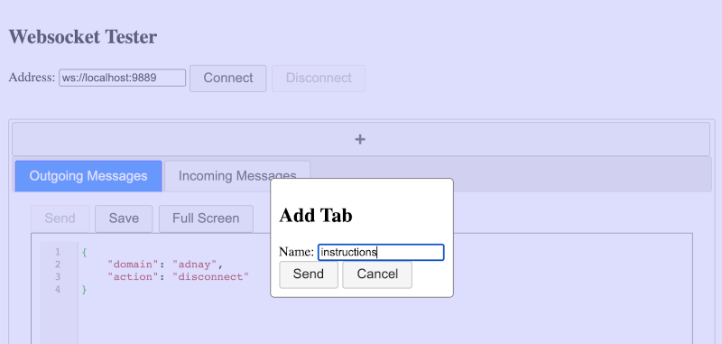
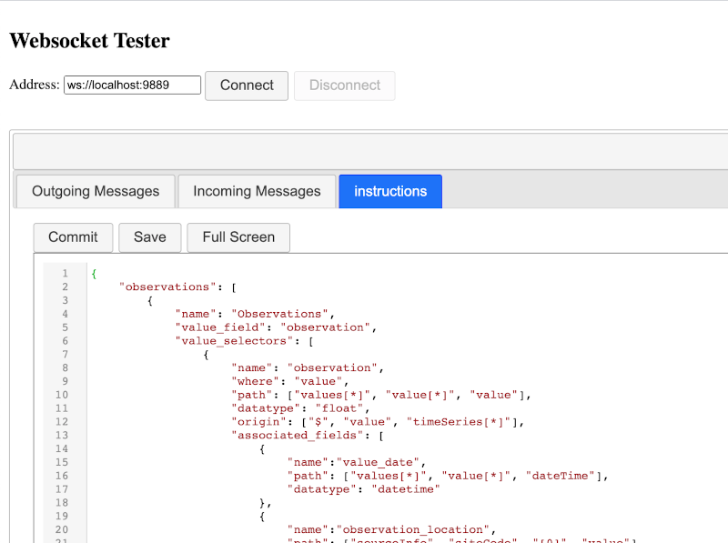
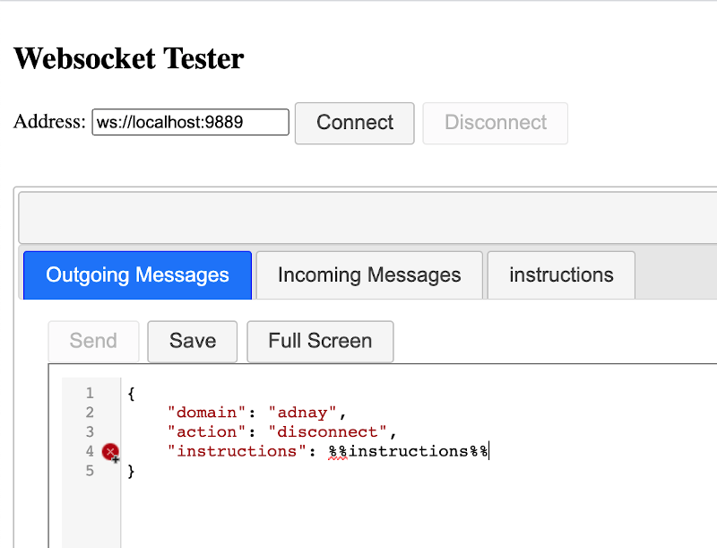

# WebsocketTester

A relatively simple webpage for testing websockets. No server is necessarry; all operations run directly 
through the browser.

### Features

1. Multiple Tab support: Multiple tabs can be opened within the page to support multiple editors
2. Real time stream output: Data coming into the page from its websocket get rendered in a readonly editor along with 
their transmission times
3. Variable templating: tabs can be named and referenced by name within the core editor
4. Resource caching: tab and editor data are saved in real time so data may be retrieved upon reload. Data will still 
be available after navigating away either through core editor retention or tab caching.

### Variable Templating

Say I add a new tab named `instructions`:

And I add text to it:

I can add that JSON into an upcoming `send` function through the websocket by inserting `%%instructions%%` into the 
core editor:

Bear in mind that the linter *will* find issue with it. The resulting document will be considered valid at the 
end **IF**:

1. The variable `%%instructions%%` was used outside any possible quotes
2. There is a tab named `instructions`
3. The contents of `instructions` is valid JSON data

Any user created tab may be referenced by `%%<tab name>%%`.